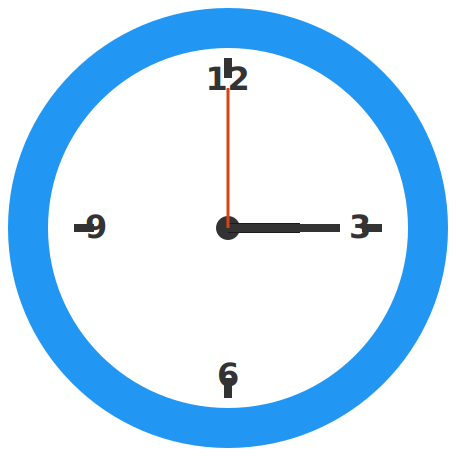

# Clock Exerciser

An educational .NET MAUI application to help users learn to read analog clocks and convert between analog and digital time formats.



## Features

### ?? Three Game Modes
- **Clock to Time**: Read the analog clock and type the time
- **Time to Clock**: Set the clock hands to match the shown time
- **Random Mode**: Mix of both challenges for varied practice

### ?? Bilingual Support
- **English** and **Dutch (Nederlands)** languages
- Natural language time input:
  - English: "quarter past three", "ten to four", "half past two"
  - Dutch: "kwart over vijf", "half vijf", "tien voor vier"
- Full UI localization in both languages

### ? Smart Time Parsing
- Digital formats: 3:15, 15:30, 03:45
- Natural language in English and Dutch
- Handles 12/24 hour time formats
- Tolerant matching with smart validation

### ?? Modern UI
- Clean, intuitive interface
- Animated clock visualization using Syncfusion Gauges
- Real-time clock hand movement
- Visual feedback for correct/incorrect answers
- Playful color scheme

## Technology Stack

- **.NET 10 (MAUI)** - Cross-platform framework
- **C# 14.0** - Latest language features
- **Syncfusion.Maui.Gauges** - Clock visualization
- **MVVM Pattern** - Clean architecture
- **Shell Navigation** - Modern navigation

### Target Platforms
- ? Android (21+)
- ? iOS (15.0+) - Coming soon
- ? Windows (10.0.17763+) - Coming soon
- ? macOS (Catalyst) - Coming soon

## Getting Started

### Prerequisites
- Visual Studio 2022 (17.12+) with .NET MAUI workload
- .NET 10 SDK
- Android SDK (for Android development)

### Building the Project

1. **Clone the repository**
```bash
git clone https://github.com/Impesoft/ClockExerciser.git
cd ClockExerciser
```

2. **Restore packages**
```bash
dotnet restore
```

3. **Build and run**
```bash
# Debug build
dotnet build ClockExerciser/ClockExerciser.csproj

# Run on Android
dotnet build -t:Run -f net10.0-android
```

### Building for Release (Android)

See [`ANDROID_BUILD_QUICKSTART.md`](ANDROID_BUILD_QUICKSTART.md) for detailed instructions.

**Quick version:**
1. Run `.\setup-android-signing.ps1` (one-time setup)
2. Restart Visual Studio
3. Run `.\build-android-release.ps1`

**Note:** The project is configured with `EmbedAssembliesIntoApk=true` for reliable deployment.

**Troubleshooting:** See [`Documents/ANDROID_TROUBLESHOOTING.md`](Documents/ANDROID_TROUBLESHOOTING.md) for common issues.

## Project Structure

```
ClockExerciser/
??? Pages/              # XAML views
?   ??? MenuPage        # Landing page with mode selection
?   ??? GamePage        # Main game interface
??? ViewModels/         # MVVM ViewModels
??? Models/             # Data models and enums
??? Services/           # Business logic
?   ??? LocalizationService
?   ??? AudioService
?   ??? DutchTimeParser
?   ??? EnglishTimeParser
??? Resources/
?   ??? Images/         # App icon, assets
?   ??? Splash/         # Splash screen
?   ??? Strings/        # Localization resources
?   ??? Raw/            # Audio files (to be added)
??? Documents/          # Project documentation
```

## Documentation

- **[PROJECT_PLAN.md](Documents/PROJECT_PLAN.md)** - Development roadmap and progress
- **[ARCHITECTURE.md](Documents/ARCHITECTURE.md)** - Technical architecture details
- **[ANDROID_SIGNING_GUIDE.md](Documents/ANDROID_SIGNING_GUIDE.md)** - Android code signing setup
- **[ANDROID_BUILD_QUICKSTART.md](ANDROID_BUILD_QUICKSTART.md)** - Quick build instructions

## Current Status

### ? Completed (Phases 1-4, 7)
- Full navigation structure
- Menu and game pages
- Bilingual localization
- Natural language time parsing
- Clock visualization
- Answer validation
- App icon and splash screen
- **Audio feedback with actual sound files** ? **NEW!**
- Android code signing

### ?? In Progress
- ~~Audio feedback~~ ? Complete!
- Visual animations
- Score tracking

### ? Planned
- Unit tests
- iOS/Windows deployment
- Settings page
- Timer mode

**Overall Progress: ~80%**

## Contributing

This is an educational project. Contributions are welcome!

1. Fork the repository
2. Create a feature branch
3. Make your changes
4. Submit a pull request

## License

[Specify your license here]

## Credits

- **Syncfusion** - Gauge components for clock visualization
- **.NET MAUI Team** - Cross-platform framework

## Contact

Created by Ward Impe
- GitHub: [@Impesoft](https://github.com/Impesoft)

---

**Version**: 1.0.0
**Last Updated**: December 2024
